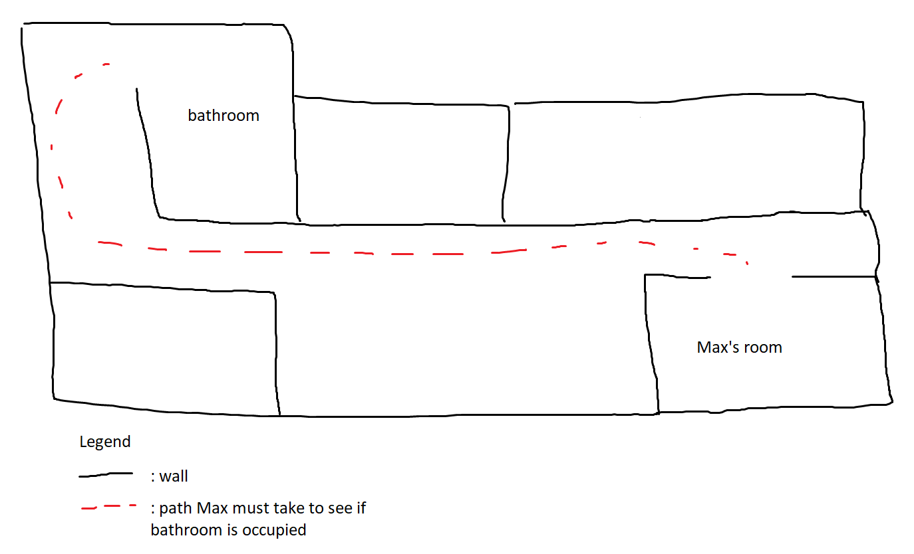
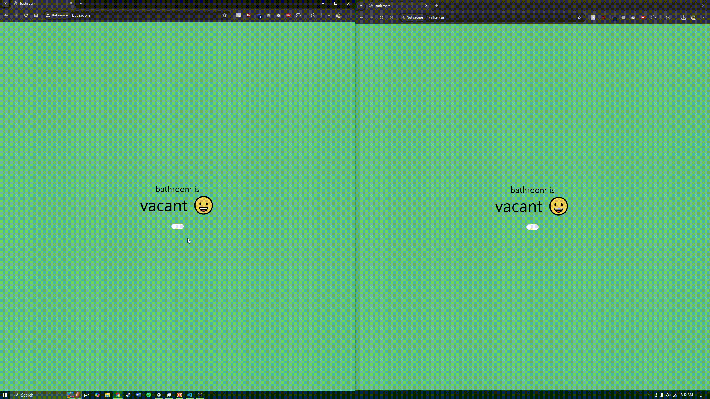

# Occ-loo-pied

Like "occupied," but not really because its "occ-loo-pied."

## Summary
My roommate (For anonymity purposes lets call him "Max") and I share a bathroom in our apartment. However, Max's room and the bathroom are on opposite sides of the apartment. On top of that, he doesn't have a direct line of sight from his room to the bathroom, so he can't just peek his head out the door to see if its in use. Here's a detailed diagram of the issue:

The goal of this project is to make it easy for him to check if the bathroom is in use.

## Solution
This project consists (or will consist) of three parts:
1. Server
2. Client webpage/widget
3. Physical button

## Webpage demo

### Server
I created a server to run on my home server that keeps track of a boolean in-memory of whether the bathroom is occupied or not. It has endpoints to get and update the boolean. It will also serve the webpage that displays this boolean.

### Widget
I will create either a webpage or a widget that Max can easily view. This way he can quickly see on his phone whether the bathroom is occloopied or not.

### Button
To determine whether or not the bathroom is occupied, there will be a physical button in front of the bathroom door. When pressed, it will send an API request to the server to update the bathroom occupancy status. It will also light up when the bathroom is occupied!

## Stack
Svelte (client)/Golang (server)/C++ (hardware)

GitHub Actions automatically builds and publishes the Docker image of this app to DockerHub. I have [Watchtower](https://github.com/containrrr/watchtower) running on my server which automatically pulls and deploys the Docker container.

## Development Setup
1. Build the web static files: `npm run build`
2. Run the go server: `go run cmd/main.go`
